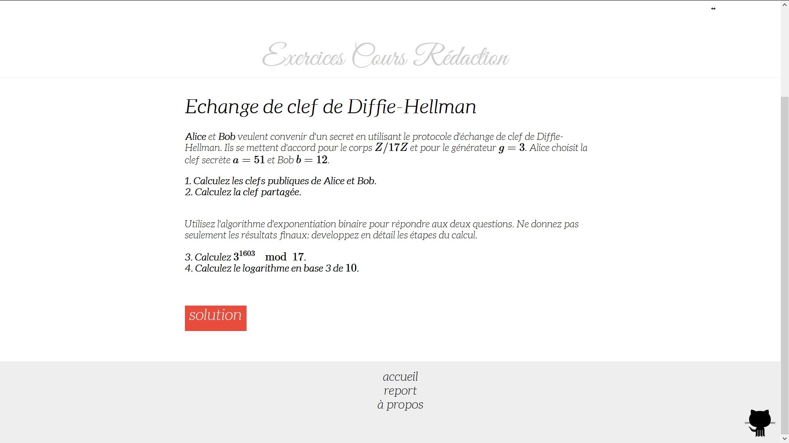

# [webbapp](https://github.com/rootasjey/webbapp)

It's a web-platform where students can practice mathematic and computer science exercices.
A UVSQ's project.
The nice jinja2 extension to run python code uses the [CreateFunction from this sample](http://code.activestate.com/recipes/550804-create-a-restricted-python-function-from-a-string/)

#updates
* **last**: updated redaction UI
* **next**: create global variables (python)

#How to install (Windows)
* Install [Pyhton 2.7 or later (or Python 3.4 or later, but it's experimental)](https://www.python.org/download/)
* Run the python script **distribute_setup.py** (located in the 'install' folder) to install **easy_install**
* Add **easy_install** to the PATH environment :
	* Right clic on *Computer* -> Properties
	* Clic on *Advanced system settings* on the left panel (win7 or later)
	* Clic on *Environment Variables...*
	* In the *System variables* section, double-clic on the variable named 'Path'
	* Then add *';C:\Python27\Scripts'* at the end of the line. (Check that this folder exists to be 100% sure)
* Now, you can run the windows' command prompt *cmd*, and enter these lines :
	* easy_install pip
	* pip install Jinja2
	* pip install flask
	* pip install Werkseug (if it isn't automatically installed)
* You're ready to go, try to run the **application.py** python script
* And Voilà!

#Languages
* python
* html/css
* javascript

#Developers:
* Jeremie CORPINOT
* Somia KATIR

#Supervisor
* Lucas De Feo

# librairies
* [python](https://www.python.org/)
* [jinja2](http://jinja.pocoo.org/)
* [flask](http://flask.pocoo.org/)
* [highlight.js](http://highlightjs.org/)
* [fontsquirrel](http://www.fontsquirrel.com/)

#screnshots

